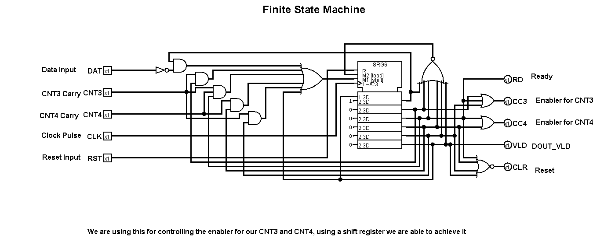

# Universal Asynchronous Receiver Transmitter

<!-- First Section -->
## Team 1
<details>
  <summary>Detail</summary>

  > Semester: 3rd Sem B. Tech. CSE

  > Section: S2

  > Member-1: Akshay L B, 221CS205, akshaylb.221cs205@nitk.edu.in

  > member-2: Krishna Bhargav N,221CS228, krishnabhargavn.221cs228@nitk.edu.in 

  > Member-3: Shreyas Gowda P, 3.	221CS247, shreyasgowdap.221cs247@nitk.edu.in
</details>

<!-- Second Section -->
## Abstract
<details>
  <summary>Detail</summary>
  
 
In the realm of embedded systems and digital communication, the Universal Asynchronous Receiver/Transmitter (UART) stands as a foundational technology, facilitating the seamless exchange of serial data between devices. This abstract introduces a project focused on designing an advanced UART interface with a motivation rooted in the ever-increasing need for efficient and reliable data transmission.
 
 Background:
  UART communication has long been the linchpin of data transfer in electronics, known for its simplicity and adaptability. However, in the face of modern   demands, the conventional UART model must evolve to accommodate higher data rates, enhanced error detection, and more versatile configurations. Our        project acknowledges this need by revisiting the classic UART design and aims to address contemporary challenges.
 
Motivation:
  The motivation behind this project is twofold. First, as data-intensive applications continue to proliferate in embedded systems, the need for faster      and more error-resilient communication interfaces becomes imperative. Second, the rising prevalence of Internet of Things (IoT) devices necessitates       UART interfaces that can efficiently handle both low-power sensors and high-performance computing platforms, demanding adaptability and scalability.       This project aims to create a UART interface that bridges these gaps in data transmission, serving as a versatile solution for a wide array of             applications.
 
Unique Contribution:
  The unique contribution of this project lies in the development of an enhanced UART interface that amalgamates high-speed data transfer, improved error    detection  and a user-friendly configurability. The design incorporates hardware and software elements to provide seamless integration with both legacy    and cutting-edge devices. By adapting to the demands of modern electronics, this UART interface seeks to ensure the continued relevance of UART            communication in the evolving digital landscape, allowing it to remain a cornerstone of data transfer in the 21st century.
 
In conclusion, the proposed project endeavors to reinvigorate UART technology, aligning it with contemporary needs and serving as a versatile and robust solution for serial data communication in the digital age.

</details>

<!-- Third Section -->
## Working
<details>
  <summary>Detail</summary>
  The `impl_top.v` module orchestrates the integration of the UART communication system, combining the `uart_rx` and `uart_tx` modules into a cohesive digital ecosystem. Positioned as the top-level module, it encapsulates the interaction between the two modules and the external environment.
 
At its core, the module interfaces with the physical world through signals such as `clk`, `sw_0`, `uart_rxd`, `uart_txd`, and `led`. The `clk` signal represents the system clock, a fundamental synchronizing element in digital systems. Slide switches `sw_0` and `sw_1` introduce an interactive element, allowing users to influence the behavior of the system, showcasing the flexibility of the design.
 
The LED display, represented by the `led` output, serves as a visual indicator, providing insights into the system's internal state. Conditional logic within the always block dictates the behavior of the LEDs, responding to user input (`sw_0`) and the arrival of valid UART data (`uart_rx_valid`). This dynamic behavior highlights the module's responsiveness to both external stimuli and communication events.
 
The UART communication system is seamlessly integrated into the top-level module. The `uart_rx` and `uart_tx` modules are instantiated within the module, establishing connections between their respective signals. The `uart_rx_data` output from the receiver is directly linked to the `uart_tx_data` input of the transmitter, creating a feedback loop that mirrors the received data.
 
Additionally, the always block within the module orchestrates the behavior of the `led_reg` output. Depending on the state of `sw_0` and the reception of valid UART data, the LED display is configured to showcase different patterns. This interactive visual feedback enhances the user's understanding of the system's operation.
 
In conclusion, the `impl_top.v` module serves as the architectural nexus, harmonizing the functionalities of the `uart_rx` and `uart_tx` modules. Its interactive elements, coupled with the integration of UART communication, showcase a robust and responsive digital system.

 
The `uart_tx.v` module complements the UART communication system by serving as the transmitter counterpart to the receiver module. Acting as the digital envoy of the system, it efficiently encodes and transmits data over a UART interface. Configurable parameters, including bit rate, clock frequency, payload bits, and stop bits, ensure adaptability to a diverse range of system architectures.
 
At the core of the transmitter lies a well-structured Finite State Machine (FSM) that orchestrates the transmission process. The FSM efficiently manages state transitions, bit sampling, and cycle counting, ensuring the accurate encoding and transmission of data. Internal registers, such as `data_to_send`, `cycle_counter`, and `bit_counter`, contribute to the systematic handling of outgoing serial data.
 
Synchronized with the system clock through positive-edge-triggered always blocks, the module incorporates an asynchronous reset mechanism, enhancing its resilience to unexpected conditions. The inclusion of the `uart_tx_busy` output provides a valuable indicator of the transmitter's operational state, signaling whether it is actively processing data.
 
In terms of practicality, the module features a transparent interface for users, with outputs like `uart_txd` and `uart_tx_en`. The former represents the transmitted serial data, while the latter indicates whether the transmitter is actively processing new data. The `uart_tx_en` signal ensures controlled data transmission, aligning with the modular and adaptive design philosophy.
 
To sum up, the `uart_tx.v` module serves as the digital herald, efficiently transmitting encoded data over a UART interface. Its modular design, coupled with configurable parameters, positions it as a versatile component in digital communication systems.

The `uart_rx.v` file encapsulates the functionality of the UART (Universal Asynchronous Receiver/Transmitter) receiver module. Designed to seamlessly integrate into a larger digital system, this module facilitates communication with external devices through UART, a popular serial communication protocol. With parameters such as bit rate, clock frequency, payload bits, and stop bits configurable, it offers flexibility to adapt to diverse system requirements.
 
The heart of the receiver lies in its Finite State Machine (FSM), efficiently managing the reception process. A careful balance of state transitions, clock cycle counting, and bit sampling ensures reliable data capture. The use of internal registers, such as `recieved_data`, `cycle_counter`, and `bit_counter`, orchestrates the reception process, providing an organized structure to handle incoming serial data.
 
The module’s utilization of positive-edge-triggered always blocks reflects its synchronous design, synchronized with the system clock. Further, the inclusion of asynchronous reset functionality enhances robustness, allowing the receiver to gracefully handle unexpected conditions.
 
Complementing the internal workings, the module exposes user-friendly outputs such as `uart_rx_data`, `uart_rx_valid`, and `uart_rx_break`. These outputs signal the availability of received data, its validity, and the detection of a BREAK condition, respectively. Moreover, the code incorporates practical features like a configurable bit rate, ensuring adaptability to diverse communication scenarios.
 
In summary, `uart_rx.v` stands as a testament to effective digital communication design, encapsulating the intricacies of UART reception within a concise and modular Verilog module.

</details>

<!-- Fourth Section -->
## Logisim Circuit Diagram
<details>
  <summary>Detail</summary>
  
  Main: 
  
  
  Reciever:
  
  
  Transmitter:
  
  
  FSM:
  

  > 
</details>

<!-- Fifth Section -->
## Verilog Code
<details>
  <summary>Detail</summary>
  Main:
  ```
    // Module: impl_top
  
  module impl_top (
  input               clk     , // Top level system clock input.
  input               sw_0    , // Slide switches.
  input               sw_1    , // Slide switches.
  input   wire        uart_rxd, // UART Recieve pin.
  output  wire        uart_txd, // UART transmit pin.
  output  wire [7:0]  led
  );
  
  // Clock frequency in hertz.
  parameter CLK_HZ = 50000000;
  parameter BIT_RATE =   9600;
  parameter PAYLOAD_BITS = 8;
  
  wire [PAYLOAD_BITS-1:0]  uart_rx_data;
  wire        uart_rx_valid;
  wire        uart_rx_break;
  
  wire        uart_tx_busy;
  wire [PAYLOAD_BITS-1:0]  uart_tx_data;
  wire        uart_tx_en;
  
  reg  [PAYLOAD_BITS-1:0]  led_reg;
  assign      led = led_reg;
  
  // ------------------------------------------------------------------------- 
  
  assign uart_tx_data = uart_rx_data;
  assign uart_tx_en   = uart_rx_valid;
  
  always @(posedge clk) begin
      if(!sw_0) begin
          led_reg <= 8'hF0;
      end else if(uart_rx_valid) begin
          led_reg <= uart_rx_data[7:0];
      end
  end
  
  
  // ------------------------------------------------------------------------- 
  
  //
  // UART RX
  uart_rx #(
  .BIT_RATE(BIT_RATE),
  .PAYLOAD_BITS(PAYLOAD_BITS),
  .CLK_HZ  (CLK_HZ  )
  ) i_uart_rx(
  .clk          (clk          ), // Top level system clock input.
  .resetn       (sw_0         ), // Asynchronous active low reset.
  .uart_rxd     (uart_rxd     ), // UART Recieve pin.
  .uart_rx_en   (1'b1         ), // Recieve enable
  .uart_rx_break(uart_rx_break), // Did we get a BREAK message?
  .uart_rx_valid(uart_rx_valid), // Valid data recieved and available.
  .uart_rx_data (uart_rx_data )  // The recieved data.
  );
  
  //
  // UART Transmitter module.
  //
  uart_tx #(
  .BIT_RATE(BIT_RATE),
  .PAYLOAD_BITS(PAYLOAD_BITS),
  .CLK_HZ  (CLK_HZ  )
  ) i_uart_tx(
  .clk          (clk          ),
  .resetn       (sw_0         ),
  .uart_txd     (uart_txd     ),
  .uart_tx_en   (uart_tx_en   ),
  .uart_tx_busy (uart_tx_busy ),
  .uart_tx_data (uart_tx_data ) 
  );
  
  
  endmodule

</details>

<!-- Sixth Section -->
## Verilog Code
<details>
  <summary>Detail</summary>

  > 1.	Wikipedia
  > 2.	Stackoverflow
  > 3.	Project Uart
  > 4.	Analog.com
  > 5.	Verilog Documentation

</details>
